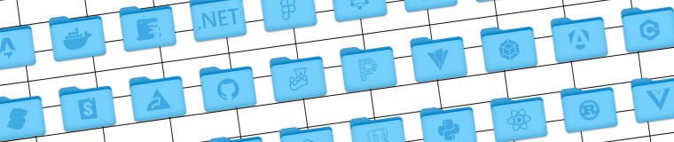

<div align="center">
  
  <h1 align="center">FolderKit</h1>
</div>

<p align="center">
  <a href="https://www.npmjs.com/package/folderkit"></a>
  <a href="https://www.npmjs.com/package/folderkit"></a>
  <a href="https://github.com/stout-ni/folderkit/actions/workflows/ci.yml"></a>
  <a href= "https://github.com/web-infra-dev/rslib"></a>
  <a href= "https://github.com/vitest-dev/vitest"></a>
  <a href= "https://github.com/biomejs/biome"></a>
  <a href="https://github.com/lovell/sharp"></a>
  <a href="#license"></a>
</p>

<p align="center">
  
</p>

## Introduction

A modern, type-safe library for generating pixel-perfect macOS folder icons programmatically, featured with:

- 🖼️ Generate beautiful macOS folder icons from any image
- 🎨 Multiple built-in themes including Big Sur Light/Dark and classic Tahoe
- 🏗️ TypeScript-first with full type definitions
- ⚡ Optimized for performance with Sharp image processing

> This project was inspired by [lgarron/folderify](https://github.com/lgarron/folderify), but rebuilt from the ground up with modern JavaScript/TypeScript practices and additional features.

## Installation

```bash
npm install folderkit
```

[Read the docs](docs/get-started.md) for any further information.

## License

This project is licensed under the MIT License - see the [LICENSE](LICENSE) file for details.
